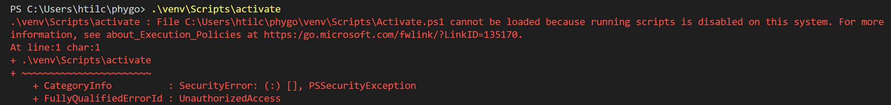

# Getting Started

### Clone PhyGO Project

`git clone https://github.com/htil/phygo.git`

### Navigate to Repo

`> cd .\phygo\`

### Create Virual environment
`python -m venv venv`

[Python Tutorial: VENV (Windows) - How to Use Virtual Environments with the Built-In venv Module
 ](https://www.youtube.com/watch?v=APOPm01BVrk)

### Activate Environment
`.\venv\Scripts\activate`

### Install Libraries

`python -m pip install -r requirements.txt`

### Update Requirements file

`python -m pip freeze > requirements.txt`

### Navigate to `.\scripts` direction

`cd .\scripts`

### Run Script

`python record_test.py`

## Other Helpful commands

### Find out where program is installed
`Get-Command python | Select-Object Source` 

### Create executable that works with brainflow
`pyinstaller .\ganglion_tester.py --collect-all brainflow --onedir --windowed` 

### Install Git on windows

`winget install --id Git.Git -e --source winget`

### Addressing Unauthorized error

`Set-ExecutionPolicy Unrestricted -Scope Process`

