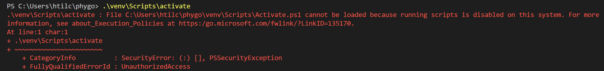

# Getting Started


### Clone PhyGO Project

`git clone https://github.com/htil/phygo.git`

### Navigate to Repo

`> cd .\phygo\`

### Create Virual environment
`python -m venv venv`

[Python Tutorial: VENV (Windows) - How to Use Virtual Environments with the Built-In venv Module
 ](https://www.youtube.com/watch?v=APOPm01BVrk)


### Activate Environment
`.\venv\Scripts\activate`


### Install Libraries

`python -m pip install -r requirements.txt`

### Update Requirements file

`python -m pip freeze > requirements.txt`

### Navigate to `.\scripts` direction

`cd .\scripts`

### Run Script

`python .\scripts\phygo_app.py`

### Analyze Data

`analyze.ipynb`

## Other Helpful commands

### Find out where program is installed
`Get-Command python | Select-Object Source` 

### Create executable that works with brainflow
`pyinstaller .\ganglion_tester.py --collect-all brainflow --onedir --windowed` 

### Install Git on windows

`winget install --id Git.Git -e --source winget`

### Addressing Unauthorized error



`Set-ExecutionPolicy Unrestricted -Scope Process`

---

## Using PhyGo App (`phygo_app.py`)

The combined PhyGo app handles event design, Ganglion recording, and file export in one workflow.

### Launch the app

From the repo root (with your virtual environment activated):

```bash
cd scripts
python phygo_app.py
```

### Tab 1: Design Events

1. Enter **Event Labels** as comma-separated values (for example: `Relax,Thumb,Index`).
2. Set **Events per Label** (how many times each label appears in the sequence).
3. Set **Sampling Frequency (Hz)** (default `200` for Ganglion / `analyze.ipynb`).
4. Set **Latency (ms)** — how long each stimulus label stays on screen before Rest.
5. Set **Rest (ms)** — how long the Rest label is shown between stimuli (default `3000`).
6. Set **Session Name** (for example: `study1`). This name is used for saved files.
7. Confirm **Project Directory** points to the `scripts` folder (or the folder that contains `data/` and `events/`).
8. Click **Generate Event** to build the preview table.
9. Review the event table. Sample times are shown in column 1; `Rest` rows are inserted automatically between stimuli.
10. Click **Confirm Events for Recording** when ready.

### Tab 2: Record

1. Enter the Ganglion **COM Port** (for example: `COM19`).
2. Optionally enable **Play sound on each event** (beeps play on stimulus labels, not Rest).
3. Click **Connect Ganglion**.
4. Click **Start Study**.
   - Recording begins immediately.
   - The app waits **5 seconds** before the first label.
   - Stimulus labels alternate with **Rest** periods.
   - After the final event, recording continues for one additional latency period.
5. Click **Stop Study** to end early, or let the sequence finish automatically.

### Files created

For session name `study1`, the app saves:

| File | Location |
|------|----------|
| Physiological data | `scripts/data/study1_data.csv` |
| Event timing | `scripts/events/study1.txt` |
| Event labels | `scripts/events/study1_event_labels.txt` |

Event timing values in column 1 are in **samples** (not milliseconds), aligned to when labels were actually shown during recording.

---

## Using `analyze.ipynb`

Use the notebook after completing a PhyGo recording session.

### Setup

1. Open `scripts/analyze.ipynb` in Jupyter.
2. Use the same virtual environment where `requirements.txt` is installed.
3. Run the notebook cell that defines the `Study` class.

### Run an analysis

1. Set `study_name` to match your session name (without `_data`):

```python
study_name = "study1"
```

2. Create and run the study:

```python
study = Study(
    f"data/{study_name}_data.csv",
    f"events/{study_name}.txt",
    f"events/{study_name}_event_labels.txt",
    setup_type="emg",
    tmin=-1.0,
    tmax=4.0,
)
study.run(plot_epochs=True, plot_tfr=True)
study.train()
```

3. Adjust analysis settings as needed:
   - **`setup_type`**: `"emg"` or `"eeg"` depending on your setup.
   - **`tmin` / `tmax`**: epoch window in seconds relative to each event (also controls ERDS plot x-axis range).
   - **`plot_epochs`**: show epoch plots.
   - **`plot_tfr`**: show time-frequency plots.

### Expected inputs

The notebook expects these files under `scripts/`:

- `data/{study_name}_data.csv`
- `events/{study_name}.txt`
- `events/{study_name}_event_labels.txt`

If epochs are missing or dropped, check that:

- The recording is long enough for the full event sequence plus `tmax`.
- Event sample times in `events/{study_name}.txt` align with when labels were shown.
- `tmin` and `tmax` fit within the recorded data duration.

### Outputs

Running the notebook produces ERDS plots (including `plot_ersd_linegraph()`), band-power summaries, and classifier training output from `study.train()`.

